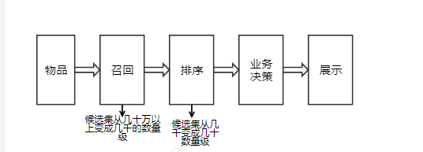

## 推荐框架
### 基本推荐算法框架

### 召回层
分布式协同过滤的召回、图的召回（Simrank）、替补召回（热度等）

### 排序层
#### 深度学习 CTR 模型的前夜
#### 深度模型

## 推荐算法

### 深度学习

## 推荐系统之常见的业务场景
### 场景一：Feed 流
这类是以信息流（Feed 流）的形式进行推荐。
今日头条是最典型的代表，内容足够多也足够优质，推荐很好地提升了用户的使用时长。
它的特点是，Feed 流会占据 APP 的主要空间，当用户浏览到最底端的时候，下面会持续出现 Feed，当用户进来后可以持续消费内容。
### 场景二：猜你喜欢
它和 Feed 流推荐最核心的区别在于：“猜你喜欢”一般是占用页面的一部分，希望实现用户行为的延伸操作。
### 场景三：相关推荐
根据计算内容或商品的相似度，进行一些相似内容或商品的推荐，以满足用户延伸阅读或者延伸购买或复购的需求。
比如用户浏览一个手机后，下面推荐了“相关手机”，阅读一篇文章后，下面推荐了“相关文章”，看了一部电影后，下面有“相关电影”，推荐内容和我们关注的内容相关。
### 场景四：热门推荐
热门推荐，比如微博的话题榜、知乎热榜等，都是通过点击、收藏、评论等用户行为计算出热门及排名，提供给用户的热门内容，满足从众心理。